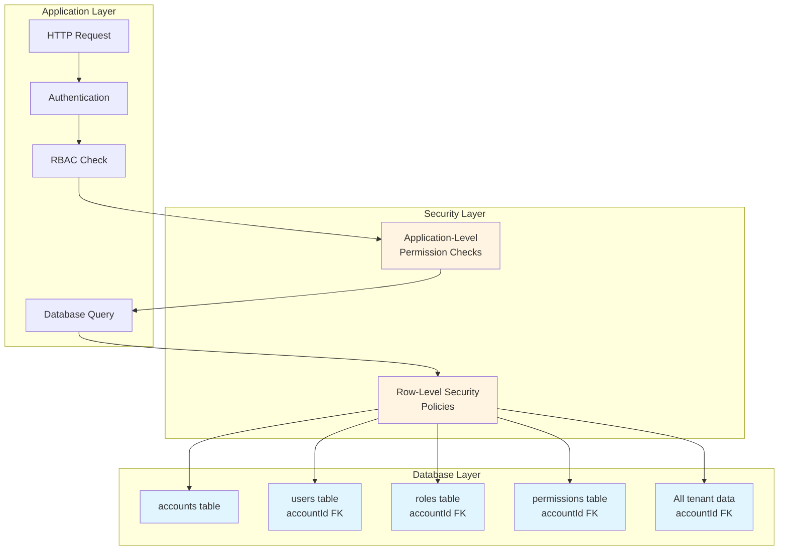
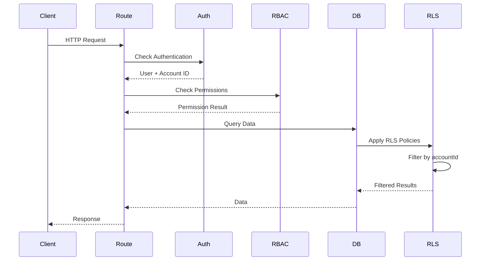
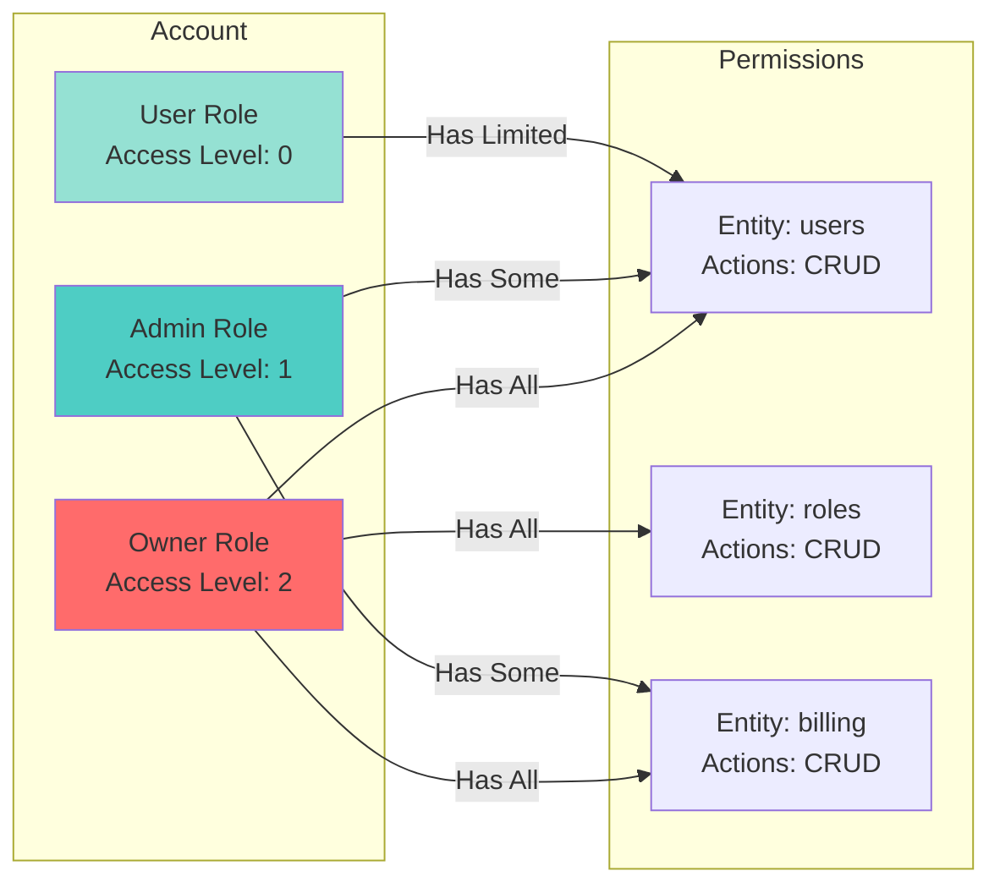

# Multi-Tenant SaaS Template

A production-ready template for building multi-tenant SaaS applications with React Router. This template provides everything you need to quickly launch a SaaS product: comprehensive marketing site, full-featured dashboard, authentication, role-based access control (RBAC), and Stripe integration.

I have stripped a whole bunch of features and functionality from other projects and then amalgamated them into this one to try and make a solid starting point for making multi-tenant SaaS applications. I'm personally using this on multiple projects and it's currently working well for me.

P.S. I did use Claude Code to stitch things together and then I've manually cleaned / double checked. I've also manually done most of the testing you can see. I exclusively used Claude to write documentation though.

## 🚀 Features

### Core Functionality

- **Multi-Tenant Architecture**: Shared database, shared schema with `accountId` isolation + Row-Level Security (RLS)
- **Authentication**: Complete auth system with Supabase (email, OAuth, password reset, email verification)
- **Role-Based Access Control**: Flexible RBAC with roles, permissions, and access levels
- **Stripe Integration**: Subscription management, webhooks, and credit system
- **Marketing Site**: Production-ready landing page with sections, pricing, and policies
- **Dashboard**: Full-featured dashboard with account management, user management, billing, and more

### Security & Production Features

- **CSRF Protection**: Built-in CSRF token validation for all forms
- **Rate Limiting**: Configurable rate limiting with in-memory and Redis adapters
- **Secure Sessions**: HttpOnly cookies with secure session management
- **Row-Level Security**: Database-level tenant isolation via Supabase RLS policies
- **Input Validation**: Zod schemas for all form inputs
- **Error Handling**: Standardized error responses and user-friendly error messages

### Developer Experience

- **Type-Safe**: Full TypeScript support with Drizzle ORM
- **Modern Stack**: React Router v7, Supabase, Drizzle ORM, Tailwind CSS
- **Adapter Pattern**: Production-ready adapters for Redis (rate limiting, caching)
- **Well-Structured**: Clean code organization with shared utilities
- **Comprehensive Docs**: Detailed documentation for all features

## 📋 Tech Stack

- **Framework**: [React Router v7](https://reactrouter.com/) - Full-stack React framework
- **Database**: PostgreSQL with [Drizzle ORM](https://orm.drizzle.team/)
- **Authentication**: [Supabase Auth](https://supabase.com/auth)
- **Payments**: [Stripe](https://stripe.com/)
- **Styling**: [Tailwind CSS](https://tailwindcss.com/)
- **UI Components**: [Radix UI](https://www.radix-ui.com/)
- **Validation**: [Zod](https://zod.dev/)

## 🏗️ Architecture

### Multi-Tenancy Model

This template uses a **shared database, shared schema** approach with `accountId` isolation:



### Request Flow



### RBAC Structure



## 🚦 Quick Start

### Prerequisites

- Node.js 18+ and npm
- PostgreSQL database (or Supabase account)
- Supabase account for authentication
- Stripe account (for payments)
- Google Cloud account (for Google OAuth)

### Installation

1. **Clone the repository**

    ```bash
    git clone <your-repo-url>
    cd multi-tenant
    ```

2. **Install dependencies**

    ```bash
    npm install
    ```

3. **Set up environment variables**

    ```bash
    cp .env.example .env
    # Edit .env with your values, see README-SETUP.md for more details
    ```

4. **Run database migrations**

    ```bash
    npm run migrate
    # or
    tsx app/lib/db/migrate.ts
    ```

5. **Apply RLS policies**

    ```bash
    psql $DATABASE_URL -f scripts/apply-rls-policies.sql
    # Or copy/paste into Supabase SQL Editor
    ```

6. **Create a superuser**

    ```bash
    tsx scripts/create-superuser.ts
    ```

7. **Start development server**
    ```bash
    npm run dev
    ```

Visit `http://localhost:5173` to see your application!

For detailed setup instructions, see [Quick Start Guide](docs/QUICK_START.md).

## 📚 Documentation

- **[Architecture](docs/ARCHITECTURE.md)** - System architecture and design decisions
- **[Multi-Tenancy Guide](docs/MULTI_TENANCY.md)** - Understanding the multi-tenant model
- **[Authentication & Authorization](docs/AUTH.md)** - Auth system and RBAC
- **[API Reference](docs/API.md)** - Route structure and endpoints
- **[Database Schema](docs/DATABASE.md)** - Schema reference and migrations
- **[Stripe Integration](docs/STRIPE.md)** - Payment and subscription setup
- **[Production Adapters](docs/ADAPTERS.md)** - Redis adapters and scaling
- **[Deployment Guide](docs/DEPLOYMENT.md)** - Deploy to various platforms
- **[Environment Variables](docs/ENVIRONMENT.md)** - Configuration reference
- **[Contributing](docs/CONTRIBUTING.md)** - Development guidelines

## 🎯 Key Concepts

### Multi-Tenancy

This template implements **shared database, shared schema** multi-tenancy:

- All tenants share the same database and tables
- Data isolation via `accountId` foreign keys
- Row-Level Security (RLS) policies enforce isolation at the database level
- Application-level permission checks provide defense-in-depth

**Benefits:**

- Cost-effective (single database)
- Easier maintenance and migrations
- Better performance (shared connection pool)

**Trade-offs:**

- Requires careful RLS policy design
- All tenants share the same schema

See [Multi-Tenancy Guide](docs/MULTI_TENANCY.md) for details.

### Role-Based Access Control

The RBAC system uses three levels:

1. **Roles**: Named collections of permissions (Owner, Admin, User)
2. **Permissions**: Entity + Action combinations (e.g., `users:create`)
3. **Access Levels**: Numeric hierarchy (Owner=2, Admin=1, User=0)

Users can have multiple roles, and roles can have multiple permissions. Access levels prevent lower-level users from accessing higher-level data.

See [Authentication & Authorization](docs/AUTH.md) for details.

## 🔧 Production Considerations

### Scaling

For production deployments, consider:

- **Redis**: Use Redis adapters for rate limiting and caching (see [Adapters](docs/ADAPTERS.md))
- **Database**: Monitor query performance, add indexes as needed
- **CDN**: Use CDN for static assets
- **Monitoring**: Set up error tracking and performance monitoring

### Security

- **Environment Variables**: Never commit secrets to version control
- **RLS Policies**: Always test RLS policies thoroughly
- **Rate Limiting**: Configure appropriate limits for your use case
- **CSRF Protection**: All forms are protected by default
- **Session Security**: Use secure cookies in production

## 📦 Project Structure

```
├── app/
│   ├── lib/
│   │   ├── adapters/          # Production adapters (Redis, etc.)
│   │   ├── auth/              # Authentication utilities
│   │   ├── db/                # Database schema and migrations
│   │   └── ...                # Other utilities
│   ├── routes/
│   │   ├── _auth.*            # Authentication routes
│   │   ├── _dash.*            # Dashboard routes
│   │   ├── _mkt.*             # Marketing site routes
│   │   ├── api.*              # API endpoints
│   │   └── webhooks.*         # Webhook handlers
│   └── components/            # React components
├── scripts/                    # Database setup scripts
├── docs/                       # Documentation
└── public/                     # Static assets
```

## 🛠️ Development

### Available Scripts

- `npm run dev` - Start development server
- `npm run build` - Build for production
- `npm run start` - Start production server
- `npm run typecheck` - Type check TypeScript

### Database Scripts

- `tsx scripts/create-superuser.ts` - Create initial admin user
- `tsx scripts/seed-database.ts` - Seed with test data (dev only)
- `psql $DATABASE_URL -f scripts/apply-rls-policies.sql` - Apply RLS policies

See [Contributing Guide](docs/CONTRIBUTING.md) for development guidelines.

## 🤝 Contributing

Contributions are welcome! Please see [Contributing Guide](docs/CONTRIBUTING.md) for details.

## 📄 License

[Add your license here]

## 🙏 Acknowledgments

Built with:

- [React Router](https://reactrouter.com/)
- [Supabase](https://supabase.com/)
- [Drizzle ORM](https://orm.drizzle.team/)
- [Stripe](https://stripe.com/)

---

**Ready to build your SaaS?** Start with the [Quick Start Guide](docs/QUICK_START.md)!
