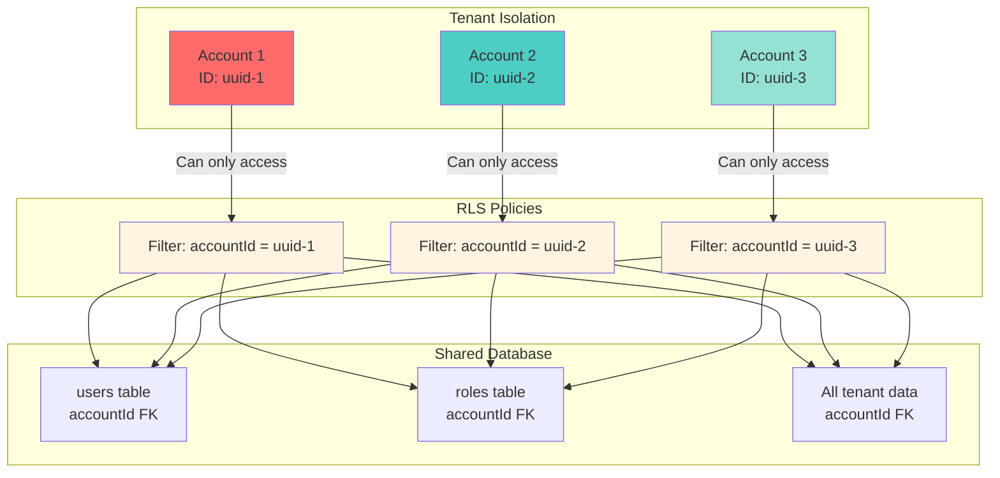
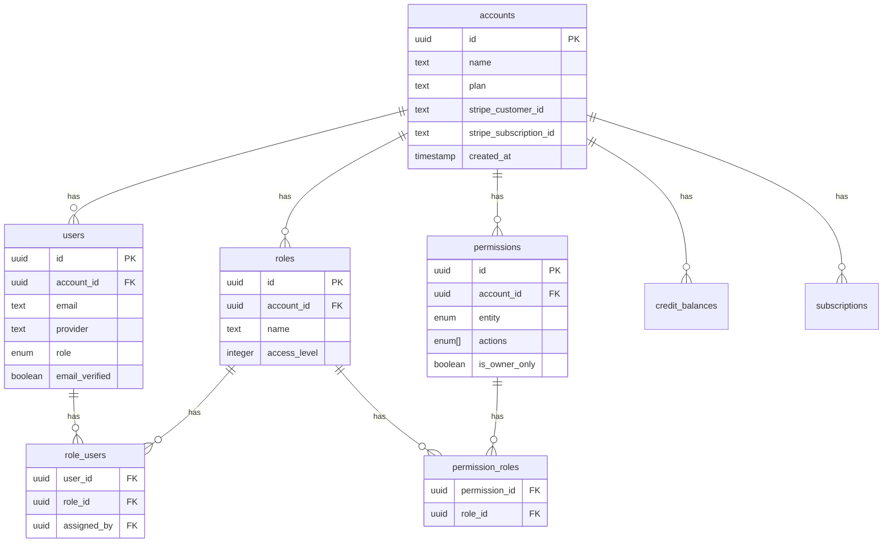
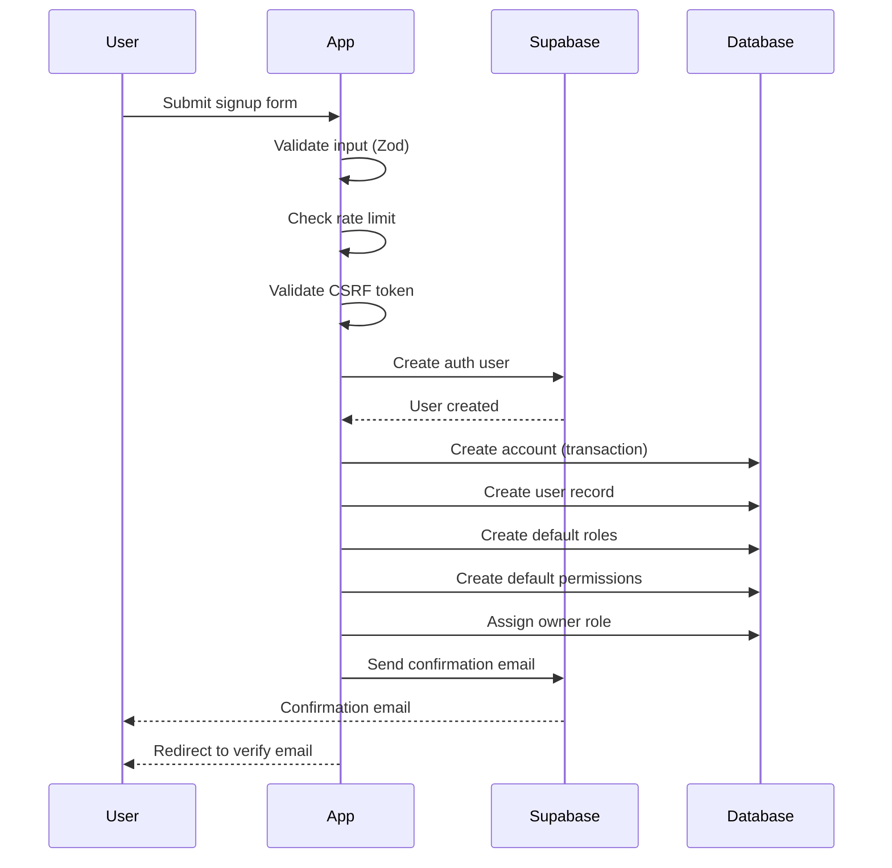
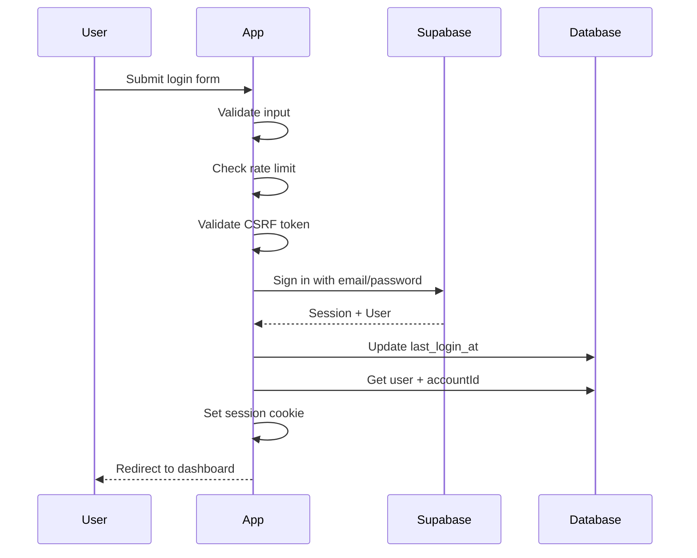
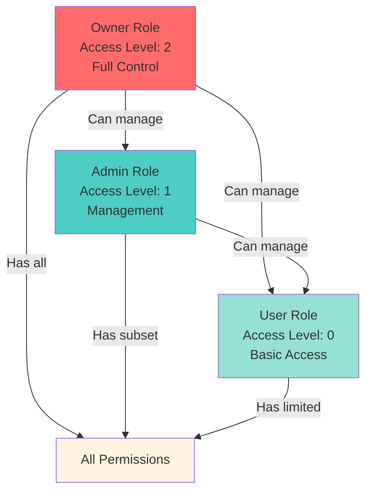
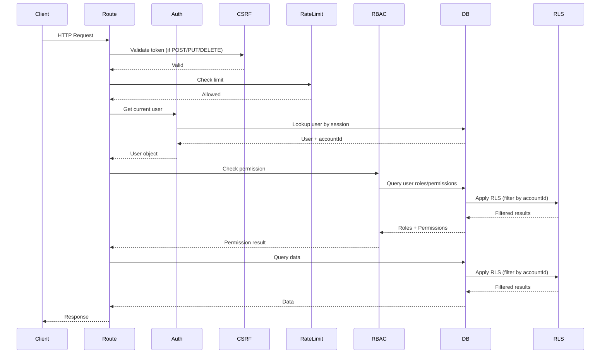
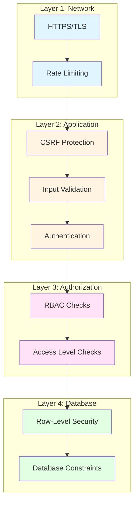
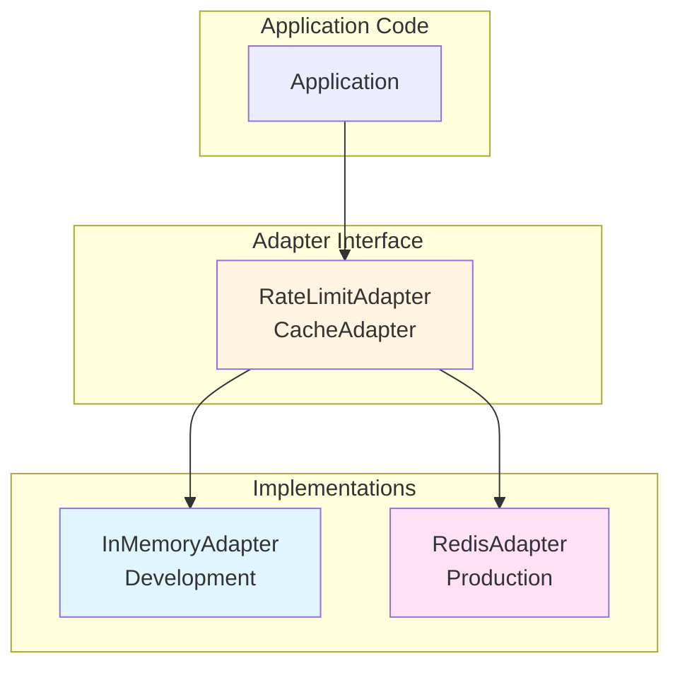

# Architecture Documentation

This document provides a comprehensive overview of the system architecture, design decisions, and how components interact.

## Table of Contents

- [Multi-Tenancy Model](#multi-tenancy-model)
- [Database Schema](#database-schema)
- [Authentication Flow](#authentication-flow)
- [RBAC System](#rbac-system)
- [Request Flow](#request-flow)
- [Security Architecture](#security-architecture)
- [Adapter Pattern](#adapter-pattern)

## Multi-Tenancy Model

### Type: Shared Database, Shared Schema

This template uses a **shared database, shared schema** approach:

- All tenants share the same PostgreSQL database
- All tenants use the same table structure (schema)
- Data isolation is achieved through `accountId` foreign keys
- Row-Level Security (RLS) policies enforce isolation at the database level

### Isolation Strategy



### Tenant Identification

Tenants are identified through the authenticated user's `accountId`:

1. User authenticates via Supabase
2. Application looks up user's `accountId` from `users` table
3. All queries are filtered by `accountId`
4. RLS policies enforce `accountId` filtering at database level

### Benefits

- **Cost-effective**: Single database instance serves all tenants
- **Easier maintenance**: Schema changes apply to all tenants
- **Better performance**: Shared connection pool, query optimization
- **Simpler backups**: Single database to backup

### Trade-offs

- **RLS complexity**: Requires careful RLS policy design
- **Schema flexibility**: All tenants share the same schema
- **Data privacy**: Requires strong RLS policies (provided)

## Database Schema

### Core Tables



### Key Relationships

1. **Accounts → Users**: One-to-many (one account has many users)
2. **Accounts → Roles**: One-to-many (one account has many roles)
3. **Accounts → Permissions**: One-to-many (one account has many permissions)
4. **Users ↔ Roles**: Many-to-many (via `role_users` table)
5. **Roles ↔ Permissions**: Many-to-many (via `permission_roles` table)

### Row-Level Security (RLS)

RLS policies are applied to all tenant-scoped tables:

```sql
-- Example RLS policy for users table
CREATE POLICY "Users can only access their account's users"
ON users FOR ALL
USING (account_id = get_user_account_id());
```

The `get_user_account_id()` function:
- Extracts the authenticated user's ID from `auth.uid()`
- Looks up the user's `accountId` from the `users` table
- Returns the `accountId` for policy filtering

## Authentication Flow

### Signup Flow



### Login Flow



### Session Management

- Sessions are managed via Supabase Auth
- Session cookies are HttpOnly and secure (in production)
- Session data includes user ID, which is used to look up `accountId`
- Sessions are validated on every request

## RBAC System

### Role Hierarchy



### Permission Model

Permissions are defined by:
- **Entity**: What resource (e.g., `users`, `roles`, `billing`)
- **Actions**: What operations (e.g., `create`, `retrieve`, `update`, `delete`)
- **Is Owner Only**: Whether only owners can have this permission

Example permissions:
- `users:create,retrieve,update,delete` - Full user management
- `roles:retrieve` - View roles only
- `billing:create,retrieve` - Create and view billing records

### Access Level Enforcement

Access levels prevent lower-level users from accessing higher-level data:

```typescript
// User with access level 1 cannot access data from access level 2
if (userAccessLevel < requiredAccessLevel) {
    throw new Error("Insufficient access level");
}
```

### Checking Permissions

```typescript
// Check if user has permission
const hasPermission = await hasPermission(
    userId,
    "users",
    "create"
);

// Get all user permissions
const permissions = await getUserPermissions(userId);

// Get manageable roles (based on access level)
const roles = await getManageableRoles(userId);
```

## Request Flow

### Complete Request Lifecycle



### Route Structure

Routes are organized by feature:

- `_auth.*` - Authentication routes (login, signup, password reset)
- `_dash.*` - Dashboard routes (protected, require authentication)
- `_mkt.*` - Marketing site routes (public)
- `api.*` - API endpoints
- `webhooks.*` - Webhook handlers (Stripe, etc.)

### Loader vs Action

- **Loaders**: Run on GET requests, fetch data, return to component
- **Actions**: Run on POST/PUT/DELETE requests, mutate data, redirect

## Security Architecture

### Defense in Depth



### Security Features

1. **CSRF Protection**: All forms include CSRF tokens
2. **Rate Limiting**: Configurable limits on auth endpoints
3. **Input Validation**: Zod schemas validate all inputs
4. **Secure Sessions**: HttpOnly, secure cookies
5. **RLS Policies**: Database-level tenant isolation
6. **Permission Checks**: Application-level authorization

## Adapter Pattern

The template uses an adapter pattern for production services:



### Benefits

- **Flexibility**: Switch implementations without changing application code
- **Testing**: Easy to mock adapters in tests
- **Scaling**: Start with in-memory, upgrade to Redis when needed

See [Adapters Documentation](ADAPTERS.md) for details.

## Performance Considerations

### Database

- **Indexes**: All foreign keys are indexed
- **Query Optimization**: Use Drizzle's query builder for efficient queries
- **Connection Pooling**: PostgreSQL connection pooling via `postgres` library

### Caching

- **Permissions**: Cache user permissions (via adapter)
- **Rate Limiting**: In-memory or Redis (via adapter)
- **Session Data**: Managed by Supabase

### Scaling

- **Horizontal Scaling**: Use Redis adapters for multi-server deployments
- **Database Scaling**: Consider read replicas for read-heavy workloads
- **CDN**: Use CDN for static assets

## Next Steps

- [Multi-Tenancy Guide](MULTI_TENANCY.md) - Deep dive into multi-tenancy
- [Authentication & Authorization](AUTH.md) - Auth system details
- [Database Schema](DATABASE.md) - Complete schema reference
- [Production Adapters](ADAPTERS.md) - Using Redis and other adapters

