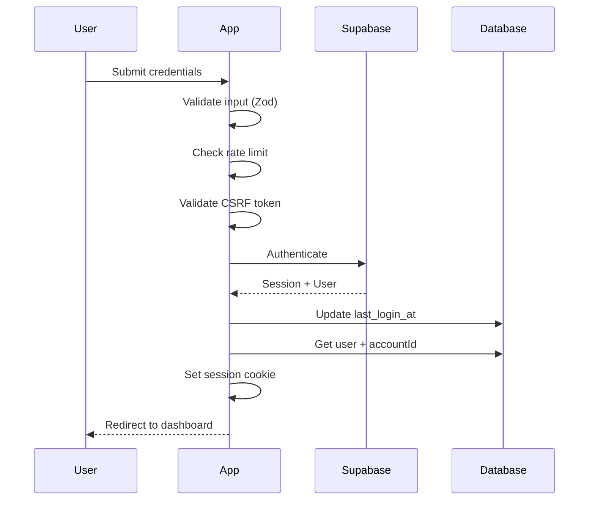
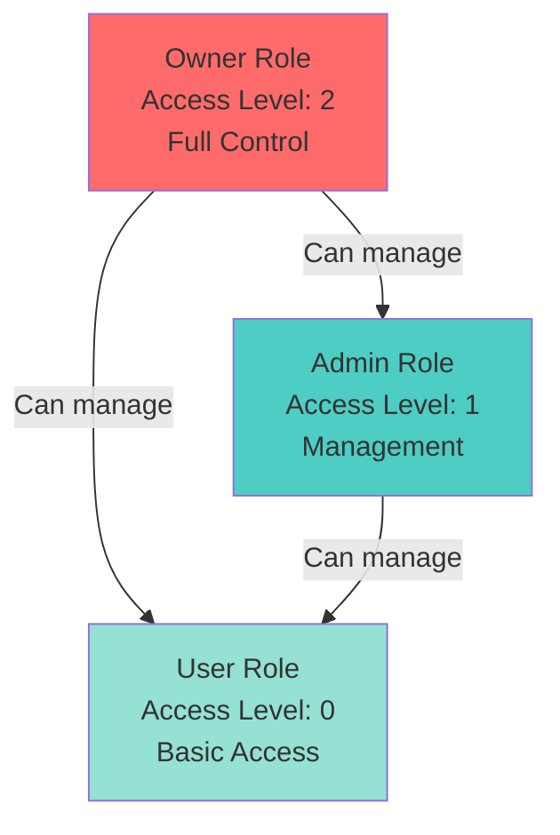

# Authentication & Authorization

Complete guide to authentication, authorization, and security features.

## Table of Contents

- [Authentication](#authentication)
- [Authorization (RBAC)](#authorization-rbac)
- [Security Features](#security-features)
- [User Management](#user-management)
- [Role Management](#role-management)
- [Permission Management](#permission-management)

## Authentication

### Overview

Authentication is handled by Supabase Auth, which provides:
- Email/password authentication
- OAuth providers (Google, GitHub, etc.)
- Magic links
- Password reset
- Email verification
- Session management

### Supported Providers

Currently supported:
- **Email/Password**: Traditional email and password signup/login
- **Google OAuth**: Sign in with Google account

To add more providers, configure them in Supabase Dashboard → Authentication → Providers.

### Authentication Flow



### Signup

When a user signs up:

1. **Supabase Auth**: Creates authentication user
2. **Account Creation**: Creates new account (transaction)
3. **User Record**: Creates user record linked to account
4. **Default Roles**: Creates Owner, Admin, User roles
5. **Default Permissions**: Creates permissions for all entities
6. **Role Assignment**: Assigns Owner role to new user
7. **Email Verification**: Sends confirmation email

```typescript
// Signup creates account automatically
const { accountId } = await createAccountWithUser(
    accountName,
    userId,
    userEmail,
    provider,
    providerId
);
```

### Login

Login process:

1. **Validate Input**: Zod schema validation
2. **Rate Limiting**: Check login attempts
3. **CSRF Protection**: Validate CSRF token
4. **Supabase Auth**: Authenticate user
5. **Update Database**: Update `last_login_at`
6. **Set Session**: Create session cookie
7. **Redirect**: Redirect to dashboard or `redirectTo`

### Password Reset

Password reset flow:

1. User requests password reset (`/auth/forgot-password`)
2. System sends reset email via Supabase
3. User clicks link in email
4. User sets new password (`/auth/reset-password`)
5. Password is updated in Supabase

### Email Verification

Email verification flow:

1. User signs up
2. System sends verification email
3. User clicks verification link
4. Email is verified (`/auth/confirm`)
5. User can now log in

### Social Login (OAuth)

OAuth flow:

1. User clicks "Sign in with Google" (`/auth/social?provider=google`)
2. Redirects to Google OAuth
3. User authorizes
4. Google redirects back (`/auth/callback`)
5. System creates/updates user and account
6. User is logged in

### Session Management

Sessions are managed via Supabase Auth:

- **HttpOnly Cookies**: Session cookies are HttpOnly (not accessible via JavaScript)
- **Secure Cookies**: Secure flag enabled in production
- **Session Validation**: Sessions validated on every request
- **Automatic Refresh**: Supabase automatically refreshes expired sessions

## Authorization (RBAC)

### Role-Based Access Control

The RBAC system uses three concepts:

1. **Roles**: Named collections of permissions (Owner, Admin, User)
2. **Permissions**: Entity + Action combinations (e.g., `users:create`)
3. **Access Levels**: Numeric hierarchy (Owner=2, Admin=1, User=0)

### Role Hierarchy



### Permission Model

Permissions are defined by:

- **Entity**: What resource (e.g., `users`, `roles`, `billing`)
- **Actions**: What operations (e.g., `create`, `retrieve`, `update`, `delete`)
- **Is Owner Only**: Whether only owners can have this permission

Example permissions:
- `users:create,retrieve,update,delete` - Full user management
- `roles:retrieve` - View roles only
- `billing:create,retrieve` - Create and view billing records

### Checking Permissions

#### In Loaders/Actions

```typescript
import { hasPermission } from "~/lib/permissions.server";
import { requireUser } from "~/lib/auth/auth.server";

export async function action({ request }: ActionFunctionArgs) {
    const { appUser } = await requireUser(request);
    
    // Check if user has permission
    const canCreate = await hasPermission(
        appUser.id,
        "users",
        "create"
    );
    
    if (!canCreate) {
        return json({ error: "Insufficient permissions" }, { status: 403 });
    }
    
    // Proceed with operation
}
```

#### Get All User Permissions

```typescript
import { getUserPermissions } from "~/lib/permissions.server";

const permissions = await getUserPermissions(userId);
// Returns: [{ entity: "users", actions: ["create", "retrieve", ...] }, ...]
```

#### Check Access Level

```typescript
import { getUserAccessLevel } from "~/lib/permissions.server";

const accessLevel = await getUserAccessLevel(userId);
// Returns: 2 (owner), 1 (admin), 0 (user), or -1 (no access)
```

### Access Level Enforcement

Access levels prevent lower-level users from accessing higher-level data:

```typescript
import { getUserAccessLevel } from "~/lib/permissions.server";

const userLevel = await getUserAccessLevel(userId);
const requiredLevel = 2; // Owner level

if (userLevel < requiredLevel) {
    throw new Error("Insufficient access level");
}
```

### Owner Role

Users with the "owner" role:
- Always have all permissions (bypassed in permission checks)
- Cannot be removed from account
- Can manage all other users and roles
- Have access level 2 (highest)

## Security Features

### CSRF Protection

All forms are protected with CSRF tokens:

```typescript
// In loader
const { token: csrfToken, headers } = await getCsrfTokenWithHeaders(request);

// In form
<input type="hidden" name="csrf_token" value={csrfToken} />

// In action
await requireCsrfToken(request);
```

CSRF tokens:
- Generated per session
- Validated on every POST/PUT/DELETE request
- Regenerated after successful validation
- Prevent cross-site request forgery attacks

### Rate Limiting

Rate limiting prevents abuse:

```typescript
import { checkRateLimit, rateLimitPresets } from "~/lib/rate-limit.server";

const result = checkRateLimit(request, rateLimitPresets.login);
if (!result.allowed) {
    return json({ error: "Too many requests" }, { status: 429 });
}
```

Default limits:
- **Login**: 5 attempts per 15 minutes
- **Signup**: 3 attempts per hour
- **Password Reset**: 3 attempts per hour
- **Resend Confirmation**: 3 attempts per hour

See [Production Adapters](ADAPTERS.md) for Redis-based rate limiting.

### Input Validation

All inputs are validated with Zod:

```typescript
import { loginSchema, safeValidateFormData } from "~/lib/auth/validation.server";

const validation = safeValidateFormData(loginSchema, formData);
if (!validation.success) {
    return json({ error: validation.error }, { status: 400 });
}
```

Validation schemas:
- `loginSchema`: Email and password
- `signupSchema`: Email and password
- `forgotPasswordSchema`: Email
- `resetPasswordSchema`: Password and confirmation
- `setupPasswordSchema`: Password and confirmation

### Secure Cookies

Session cookies are secure:

- **HttpOnly**: Not accessible via JavaScript
- **Secure**: Only sent over HTTPS in production
- **SameSite**: Lax (CSRF protection)
- **Path**: `/` (available site-wide)
- **MaxAge**: 30 days (configurable)

### Error Handling

Standardized error responses:

```typescript
import { createErrorResponse, mapAuthError } from "~/lib/auth/errors.server";

try {
    // Operation
} catch (error) {
    return createErrorResponse(mapAuthError(error), 400);
}
```

Error format:
```typescript
{
    error: "User-friendly error message",
    status: 400
}
```

## User Management

### Inviting Users

Invite users to your account:

1. Go to **Dashboard → Account → Users**
2. Click **Invite User**
3. Enter email and select role
4. User receives invitation email
5. User accepts invitation and sets password

### User Roles

Users can have multiple roles:
- Roles are assigned per account
- Users inherit permissions from all assigned roles
- Roles can be customized per account

### User Status

Users have:
- **Email Verified**: Whether email is verified
- **Last Login**: Last login timestamp
- **Role**: Default role (owner, admin, user)
- **Account**: Which account they belong to

## Role Management

### Default Roles

Every account has three default roles:

1. **Owner**: Full control, access level 2
2. **Admin**: Management access, access level 1
3. **User**: Basic access, access level 0

### Creating Custom Roles

1. Go to **Dashboard → Account → Roles**
2. Click **Create Role**
3. Set name, description, and access level
4. Assign permissions to role
5. Assign role to users

### Role Permissions

Roles can have multiple permissions:
- Each permission grants access to an entity + actions
- Permissions are scoped to the account
- Owner-only permissions are only visible to owners

## Permission Management

### Permission Structure

Permissions are organized by:
- **Entity**: What resource (users, roles, billing, etc.)
- **Actions**: What operations (create, retrieve, update, delete)
- **Is Owner Only**: Whether only owners can have this permission

### Creating Permissions

Permissions are created automatically when:
- Account is created (default permissions for all entities)
- Custom permissions are added via dashboard

### Assigning Permissions

Permissions are assigned to roles:
- Go to **Dashboard → Account → Permissions**
- Select permission
- Assign to roles
- Users with those roles inherit permissions

## Best Practices

### Always Check Permissions

```typescript
// ✅ Good: Check permission before operation
const canCreate = await hasPermission(userId, "users", "create");
if (!canCreate) {
    return json({ error: "Insufficient permissions" }, { status: 403 });
}

// ❌ Bad: Assume user has permission
// Proceed without checking
```

### Use requireUser

```typescript
// ✅ Good: Use requireUser to get authenticated user
const { appUser, accountId } = await requireUser(request);

// ❌ Bad: Manually get user from session
const user = await getCurrentUser(request);
```

### Validate Inputs

```typescript
// ✅ Good: Validate with Zod
const validation = safeValidateFormData(schema, formData);
if (!validation.success) {
    return createErrorResponse(validation.error, 400);
}

// ❌ Bad: Trust user input
const email = formData.get("email"); // No validation
```

### Handle Errors Gracefully

```typescript
// ✅ Good: Map errors to user-friendly messages
catch (error) {
    return createErrorResponse(mapAuthError(error), 400);
}

// ❌ Bad: Expose internal errors
catch (error) {
    return json({ error: error.message }, { status: 500 });
}
```

## Next Steps

- **[Architecture](ARCHITECTURE.md)**: System architecture overview
- **[Multi-Tenancy Guide](MULTI_TENANCY.md)**: Tenant isolation
- **[API Reference](API.md)**: Route documentation
- **[Production Adapters](ADAPTERS.md)**: Scaling with Redis

