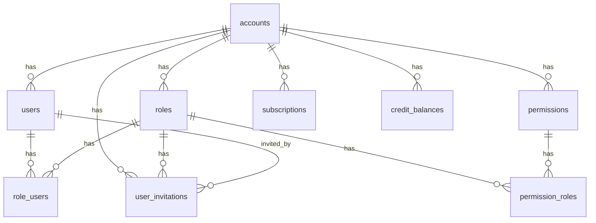

# Database Schema Reference

Complete reference for the database schema, migrations, and RLS policies.

## Table of Contents

- [Schema Overview](#schema-overview)
- [Core Tables](#core-tables)
- [Relationships](#relationships)
- [Migrations](#migrations)
- [RLS Policies](#rls-policies)
- [Indexes](#indexes)

## Schema Overview

The database uses PostgreSQL with Drizzle ORM. All tenant-scoped tables include an `accountId` foreign key for multi-tenant isolation.

### Key Design Principles

1. **Multi-Tenancy**: All tenant data scoped by `accountId`
2. **RBAC**: Roles, permissions, and role-permission assignments
3. **Audit Trail**: Timestamps on all tables (`created_at`, `updated_at`)
4. **Cascading Deletes**: Related data deleted when account is deleted
5. **Indexes**: All foreign keys and frequently queried columns indexed

## Core Tables

### `accounts`

The root table for multi-tenancy. Each account represents a tenant.

```typescript
{
    id: uuid (PK)
    name: text
    plan: text (default: "free")
    stripeCustomerId: text (unique)
    stripeSubscriptionId: text (unique)
    subscriptionStatus: enum
    seatQuantity: integer (default: 1)
    seatLimit: integer (nullable)
    billingEmail: text (nullable)
    billingCurrency: text (default: "AUD")
    billingCountry: text (default: "AU")
    taxExempt: boolean (default: false)
    createdAt: timestamp
    updatedAt: timestamp
}
```

**Indexes**:
- `stripe_customer_id_idx` on `stripeCustomerId`
- `stripe_subscription_id_idx` on `stripeSubscriptionId`
- `stripe_sub_status_idx` on `subscriptionStatus`

### `users`

User accounts linked to an account (tenant).

```typescript
{
    id: uuid (PK) - matches Supabase auth.uid()
    email: text (unique)
    provider: text (e.g., "email", "google")
    providerId: text (nullable)
    role: enum ("owner", "admin", "user")
    accountId: uuid (FK → accounts.id, cascade delete)
    emailVerified: boolean (default: false)
    lastLoginAt: timestamp (nullable)
    createdAt: timestamp
    updatedAt: timestamp
}
```

**Indexes**:
- `user_email_idx` on `email`
- `user_account_id_idx` on `accountId`
- `user_provider_id_idx` on `providerId`

**Relationships**:
- Belongs to `accounts` (many-to-one)
- Has many `roleUsers` (many-to-many with roles)

### `roles`

Roles within an account. Each account has default roles (Owner, Admin, User).

```typescript
{
    id: uuid (PK)
    accountId: uuid (FK → accounts.id)
    name: text
    description: text (default: "")
    accessLevel: integer (0-2, higher = more access)
    createdAt: timestamp
    updatedAt: timestamp
}
```

**Indexes**:
- `unique_role_name_account` on (`name`, `accountId`)
- `roles_account_id_idx` on `accountId`

**Default Roles**:
- **Owner** (accessLevel: 2): Full control
- **Admin** (accessLevel: 1): Management access
- **User** (accessLevel: 0): Basic access

### `permissions`

Permissions define what actions can be performed on entities.

```typescript
{
    id: uuid (PK)
    accountId: uuid (FK → accounts.id, cascade delete)
    entity: enum ("account", "users", "roles", "permissions", "subscriptions", "billing", "usage_metrics")
    actions: enum[] (["create", "retrieve", "update", "delete"])
    description: text (default: "")
    isCritical: boolean (default: false)
    isOwnerOnly: boolean (default: false)
    createdAt: timestamp
    updatedAt: timestamp
}
```

**Indexes**:
- `unique_entity_action` on (`entity`, `actions`)
- `permissions_account_id_idx` on `accountId`

**Entities**:
- `account`: Account management
- `users`: User management
- `roles`: Role management
- `permissions`: Permission management
- `subscriptions`: Subscription management
- `billing`: Billing operations
- `usage_metrics`: Usage tracking

### `role_users`

Many-to-many relationship between users and roles.

```typescript
{
    userId: uuid (FK → users.id)
    roleId: uuid (FK → roles.id, cascade delete)
    assignedBy: uuid (FK → users.id, nullable)
    assignedAt: timestamp (default: now)
}
```

**Primary Key**: Composite (`userId`, `roleId`)

**Indexes**:
- `user_id_idx` on `userId`
- `role_users_unique_idx` on (`userId`, `roleId`)

### `permission_roles`

Many-to-many relationship between roles and permissions.

```typescript
{
    roleId: uuid (FK → roles.id, cascade delete)
    permissionId: uuid (FK → permissions.id, cascade delete)
}
```

**Primary Key**: Composite (`roleId`, `permissionId`)

### `user_invitations`

Invitations for users to join an account.

```typescript
{
    id: uuid (PK)
    accountId: uuid (FK → accounts.id, cascade delete)
    email: text
    roleId: uuid (FK → roles.id)
    invitedBy: uuid (FK → users.id)
    token: text (unique)
    expiresAt: timestamp
    acceptedAt: timestamp (nullable)
    createdAt: timestamp
    updatedAt: timestamp
}
```

**Indexes**:
- `user_invitations_account_id_idx` on `accountId`
- `user_invitations_token_idx` on `token`
- `user_invitations_email_idx` on `email`

### `credit_balances`

Credit balances for accounts (for pay-as-you-go).

```typescript
{
    id: uuid (PK)
    accountId: uuid (FK → accounts.id, cascade delete)
    balance: numeric
    currency: text (default: "AUD")
    updatedAt: timestamp
}
```

**Indexes**:
- `credit_balances_account_id_idx` on `accountId`

### `credit_ledger`

Transaction log for credit changes.

```typescript
{
    id: uuid (PK)
    accountId: uuid (FK → accounts.id, cascade delete)
    amount: numeric
    currency: text
    description: text
    reference: text (nullable)
    createdAt: timestamp
}
```

**Indexes**:
- `credit_ledger_account_id_idx` on `accountId`
- `credit_ledger_created_at_idx` on `createdAt`

### `subscriptions`

Stripe subscription records.

```typescript
{
    id: uuid (PK)
    accountId: uuid (FK → accounts.id, cascade delete)
    stripeSubscriptionId: text (unique)
    stripeCustomerId: text
    status: enum
    currentPeriodStart: timestamp
    currentPeriodEnd: timestamp
    cancelAtPeriodEnd: boolean (default: false)
    createdAt: timestamp
    updatedAt: timestamp
}
```

**Indexes**:
- `subscriptions_account_id_idx` on `accountId`
- `subscriptions_stripe_subscription_id_idx` on `stripeSubscriptionId`

## Relationships

### Entity Relationship Diagram



### Key Relationships

1. **accounts → users**: One-to-many (one account has many users)
2. **accounts → roles**: One-to-many (one account has many roles)
3. **accounts → permissions**: One-to-many (one account has many permissions)
4. **users ↔ roles**: Many-to-many via `role_users`
5. **roles ↔ permissions**: Many-to-many via `permission_roles`

## Migrations

### Creating Migrations

Migrations are managed with Drizzle Kit:

```bash
# Generate migration from schema changes
npx drizzle-kit generate

# Apply migrations
npm run migrate
# or
tsx app/lib/db/migrate.ts
```

### Migration Files

Migrations are stored in `app/lib/db/migrations/`:

```
migrations/
├── 0000_initial.sql
├── 0001_add_feature.sql
└── meta/
    ├── _journal.json
    └── 0000_snapshot.json
```

### Running Migrations

**Development**:
```bash
npm run migrate
```

**Production**:
```bash
# Via platform console or SSH
tsx app/lib/db/migrate.ts
```

**Via Supabase**:
1. Copy migration SQL
2. Paste into Supabase SQL Editor
3. Run migration

### Migration Best Practices

1. **Test Locally**: Always test migrations locally first
2. **Backup**: Backup database before running migrations in production
3. **Review SQL**: Review generated SQL before applying
4. **Rollback Plan**: Have a rollback plan for production migrations
5. **Indexes**: Add indexes for new foreign keys and frequently queried columns

## RLS Policies

Row-Level Security (RLS) policies enforce tenant isolation at the database level.

### Enabling RLS

RLS is enabled on all tenant-scoped tables:

```sql
ALTER TABLE users ENABLE ROW LEVEL SECURITY;
ALTER TABLE roles ENABLE ROW LEVEL SECURITY;
-- ... etc
```

### Helper Function

The `get_user_account_id()` function extracts the current user's `accountId`:

```sql
CREATE OR REPLACE FUNCTION get_user_account_id()
RETURNS uuid
LANGUAGE plpgsql
SECURITY DEFINER
STABLE
AS $$
DECLARE
    account_id_val uuid;
BEGIN
    SELECT account_id INTO account_id_val
    FROM users
    WHERE id = auth.uid();
    
    RETURN account_id_val;
END;
$$;
```

### Policy Examples

#### Users Table

```sql
-- SELECT: Users can only see users from their account
CREATE POLICY "Users can select their account's users"
ON users FOR SELECT
USING (account_id = get_user_account_id());

-- INSERT: Users can insert users into their account
CREATE POLICY "Users can insert into their account's users"
ON users FOR INSERT
WITH CHECK (account_id = get_user_account_id());

-- UPDATE: Users can update users in their account
CREATE POLICY "Users can update their account's users"
ON users FOR UPDATE
USING (account_id = get_user_account_id())
WITH CHECK (account_id = get_user_account_id());

-- DELETE: Users can delete users from their account
CREATE POLICY "Users can delete their account's users"
ON users FOR DELETE
USING (account_id = get_user_account_id());
```

### Applying RLS Policies

**Via Supabase SQL Editor** (Recommended):
1. Copy contents of `scripts/apply-rls-policies.sql`
2. Paste into Supabase Dashboard → SQL Editor
3. Run SQL

**Via psql**:
```bash
psql $DATABASE_URL -f scripts/apply-rls-policies.sql
```

### Tables Without RLS

These tables don't have RLS (global/shared data):
- `plans`: Subscription plans (shared across all accounts)
- `prices`: Pricing tiers (shared across all accounts)
- `stripe_webhook_events`: Webhook events (admin access only)

## Indexes

### Foreign Key Indexes

All foreign keys are indexed for performance:

```typescript
// Example: users table
userAccountIdx: index("user_account_id_idx").on(table.accountId)
```

### Composite Indexes

Composite indexes for unique constraints and common queries:

```typescript
// Unique role name per account
uniqueRoleNameAccount: index("unique_role_name_account").on(
    table.name,
    table.accountId
)
```

### Query Performance

Indexes are automatically created for:
- All foreign keys
- Unique constraints
- Frequently queried columns (`email`, `stripeCustomerId`, etc.)

### Adding Indexes

Add indexes in schema definition:

```typescript
export const myTable = pgTable("my_table", {
    // ... fields
}, (table) => ({
    accountIdIdx: index("my_table_account_id_idx").on(table.accountId),
    emailIdx: index("my_table_email_idx").on(table.email),
}));
```

Then generate and run migration:

```bash
npx drizzle-kit generate
npm run migrate
```

## Schema Changes

### Adding a New Table

1. **Define Schema**:
   ```typescript
   export const myTable = pgTable("my_table", {
       id: uuid("id").primaryKey().defaultRandom(),
       accountId: uuid("account_id")
           .notNull()
           .references(() => accounts.id, { onDelete: "cascade" }),
       // ... other fields
   });
   ```

2. **Add Indexes**:
   ```typescript
   (table) => ({
       accountIdIdx: index("my_table_account_id_idx").on(table.accountId),
   })
   ```

3. **Generate Migration**:
   ```bash
   npx drizzle-kit generate
   ```

4. **Add RLS Policies**:
   Add policies to `scripts/apply-rls-policies.sql`

5. **Run Migration**:
   ```bash
   npm run migrate
   ```

6. **Apply RLS**:
   Run `scripts/apply-rls-policies.sql` in Supabase SQL Editor

## Next Steps

- **[Multi-Tenancy Guide](MULTI_TENANCY.md)**: Understanding tenant isolation
- **[Architecture](ARCHITECTURE.md)**: System architecture
- **[Quick Start](QUICK_START.md)**: Database setup

