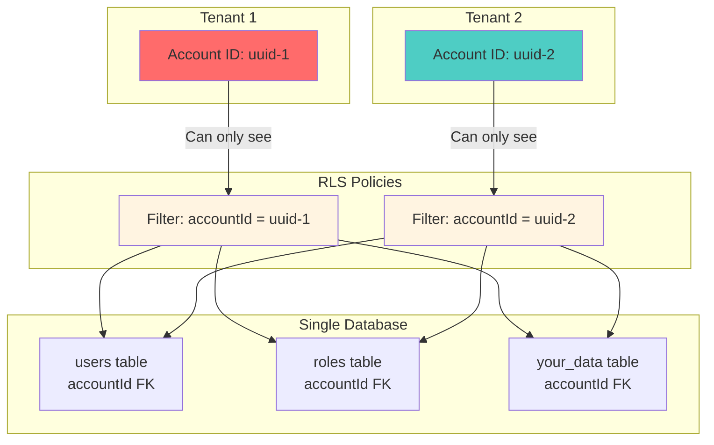
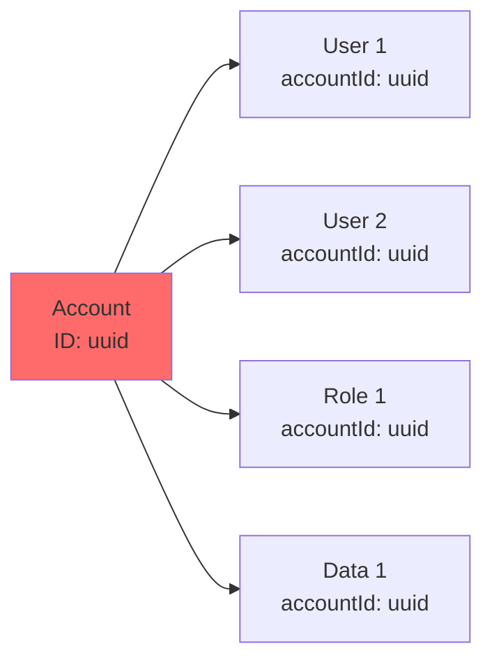

# Multi-Tenancy Guide

This guide explains how multi-tenancy works in this template and how to work with tenant-scoped data.

## What is Multi-Tenancy?

Multi-tenancy is an architecture where a single application instance serves multiple customers (tenants). Each tenant's data is isolated from others, but they share the same infrastructure.

## This Template's Approach

### Type: Shared Database, Shared Schema

This template uses a **shared database, shared schema** approach:

- ✅ All tenants share the same PostgreSQL database
- ✅ All tenants use the same table structure (schema)
- ✅ Data isolation via `accountId` foreign keys
- ✅ Row-Level Security (RLS) policies enforce isolation



### How It Works

1. **User Authentication**: User authenticates via Supabase
2. **Account Lookup**: Application looks up user's `accountId` from `users` table
3. **Data Filtering**: All queries filter by `accountId`
4. **RLS Enforcement**: Database-level RLS policies enforce `accountId` filtering

### Benefits

- **Cost-Effective**: Single database instance serves all tenants
- **Easier Maintenance**: Schema changes apply to all tenants automatically
- **Better Performance**: Shared connection pool, query optimization
- **Simpler Backups**: Single database to backup and restore

### Trade-offs

- **RLS Complexity**: Requires careful RLS policy design
- **Schema Flexibility**: All tenants share the same schema
- **Data Privacy**: Requires strong RLS policies (provided)

## Tenant Identification

### How Tenants Are Identified

Tenants are identified through the authenticated user's `accountId`:

```typescript
// 1. User authenticates
const { user } = await supabase.auth.getUser();

// 2. Look up user's accountId
const appUser = await db.query.users.findFirst({
    where: eq(users.id, user.id),
});

// 3. Use accountId for all queries
const accountId = appUser.accountId;
```

### Account Structure



- One **Account** has many **Users**
- One **Account** has many **Roles**
- One **Account** has many **Permissions**
- All tenant data references `accountId`

## Data Isolation

### Row-Level Security (RLS)

RLS policies enforce tenant isolation at the database level:

```sql
-- Example: Users can only see users from their account
CREATE POLICY "Users can only access their account's users"
ON users FOR ALL
USING (account_id = get_user_account_id());
```

The `get_user_account_id()` function:
- Extracts authenticated user ID from `auth.uid()`
- Looks up user's `accountId` from `users` table
- Returns `accountId` for policy filtering

### Application-Level Filtering

In addition to RLS, application code filters by `accountId`:

```typescript
// Always filter by accountId in queries
const accountUsers = await db
    .select()
    .from(users)
    .where(eq(users.accountId, accountId));
```

This provides **defense in depth**:
- RLS: Database-level enforcement (primary defense)
- Application: Code-level filtering (secondary defense)

## Adding Tenant-Scoped Tables

When adding new tables that should be tenant-scoped:

### 1. Add `accountId` Foreign Key

```typescript
export const myTable = pgTable("my_table", {
    id: uuid("id").primaryKey().defaultRandom(),
    accountId: uuid("account_id")
        .notNull()
        .references(() => accounts.id, { onDelete: "cascade" }),
    // ... other fields
});
```

### 2. Create RLS Policies

Add policies to `scripts/apply-rls-policies.sql`:

```sql
-- Enable RLS
ALTER TABLE my_table ENABLE ROW LEVEL SECURITY;

-- SELECT policy
CREATE POLICY "Users can select their account's my_table"
ON my_table FOR SELECT
USING (account_id = get_user_account_id());

-- INSERT policy
CREATE POLICY "Users can insert into their account's my_table"
ON my_table FOR INSERT
WITH CHECK (account_id = get_user_account_id());

-- UPDATE policy
CREATE POLICY "Users can update their account's my_table"
ON my_table FOR UPDATE
USING (account_id = get_user_account_id())
WITH CHECK (account_id = get_user_account_id());

-- DELETE policy
CREATE POLICY "Users can delete their account's my_table"
ON my_table FOR DELETE
USING (account_id = get_user_account_id());
```

### 3. Filter Queries by `accountId`

Always filter queries by `accountId`:

```typescript
// Get current user's accountId
const { accountId } = await requireUser(request);

// Query with accountId filter
const items = await db
    .select()
    .from(myTable)
    .where(eq(myTable.accountId, accountId));
```

### 4. Add Index

Add an index on `accountId` for performance:

```typescript
export const myTable = pgTable("my_table", {
    // ... fields
}, (table) => ({
    accountIdIdx: index("my_table_account_id_idx").on(table.accountId),
}));
```

## Security Considerations

### Testing Tenant Isolation

Always test that tenants cannot access each other's data:

```typescript
// Test: User from Account A cannot see Account B's data
const accountAUser = await createTestUser({ accountId: accountA.id });
const accountBData = await createTestData({ accountId: accountB.id });

// This should return empty array
const result = await db
    .select()
    .from(myTable)
    .where(eq(myTable.accountId, accountB.id));
// Should be empty when queried as accountAUser
```

### Common Pitfalls

1. **Forgetting `accountId` filter**: Always include `accountId` in WHERE clauses
2. **Bypassing RLS**: Never use service role key for regular queries
3. **Cross-tenant joins**: Ensure joins include `accountId` matching
4. **User input**: Never trust user-provided `accountId` values

### Best Practices

1. **Always use `requireUser`**: Gets authenticated user and `accountId`
2. **Filter by `accountId`**: Every tenant-scoped query should filter
3. **Test RLS policies**: Verify policies work correctly
4. **Use transactions**: For multi-step operations involving account data
5. **Validate permissions**: Check user has permission before operations

## Example: Creating Tenant-Scoped Data

```typescript
export async function action({ request }: ActionFunctionArgs) {
    // 1. Get authenticated user and accountId
    const { appUser, accountId } = await requireUser(request);
    
    // 2. Validate user has permission
    const hasPermission = await hasPermission(
        appUser.id,
        "my_entity",
        "create"
    );
    
    if (!hasPermission) {
        return json({ error: "Insufficient permissions" }, { status: 403 });
    }
    
    // 3. Create data with accountId
    const formData = await request.formData();
    const newItem = await db
        .insert(myTable)
        .values({
            accountId, // Always include accountId
            name: formData.get("name"),
            // ... other fields
        })
        .returning();
    
    return json({ item: newItem[0] });
}
```

## Example: Querying Tenant-Scoped Data

```typescript
export async function loader({ request }: LoaderFunctionArgs) {
    // 1. Get authenticated user and accountId
    const { accountId } = await requireUser(request);
    
    // 2. Query with accountId filter
    const items = await db
        .select()
        .from(myTable)
        .where(eq(myTable.accountId, accountId))
        .orderBy(desc(myTable.createdAt));
    
    return json({ items });
}
```

## Migration from Single-Tenant

If migrating an existing single-tenant app:

1. **Add `accountId` column** to all tenant-scoped tables
2. **Create default account** for existing data
3. **Update existing records** with `accountId`
4. **Add RLS policies** to all tables
5. **Update queries** to filter by `accountId`

## Performance Considerations

### Indexes

Always index `accountId` foreign keys:

```typescript
accountIdIdx: index("table_account_id_idx").on(table.accountId)
```

### Query Optimization

- Use indexes on `accountId` + other frequently queried columns
- Consider composite indexes for common query patterns
- Use `EXPLAIN ANALYZE` to verify query plans

### Scaling

- **Read Replicas**: Use read replicas for read-heavy workloads
- **Connection Pooling**: Use connection pooling (already configured)
- **Caching**: Cache frequently accessed tenant data (see [Adapters](ADAPTERS.md))

## Next Steps

- **[Architecture](ARCHITECTURE.md)**: System architecture overview
- **[Database Schema](DATABASE.md)**: Complete schema reference
- **[Authentication & Authorization](AUTH.md)**: User and permission management
- **[Production Adapters](ADAPTERS.md)**: Scaling with Redis

